# Dreamy 🌙

*A quiet place for music. Calm, plush, and yours.*

Dreamy is a self-hosted music app with a dark-purple "pillow" aesthetic. Search the
internet for a song, add it with one tap, and it lands in your own library —
downloaded, converted to MP3, and tagged with real cover art. Then listen,
favourite, shelve songs into playlists, and watch your listening story take
shape, all at your own pace.

Everything runs on hardware you own: a Postgres database, an S3-compatible
object store, a small download worker, and the Nuxt app itself — one
`docker compose up` away.

---

## ✨ What it does

- **Own your library** — find any song on YouTube and save it to a shared,
  self-hosted catalog. Tracks are stored as MP3s with embedded tags and real
  cover art in your own object storage. No accounts with anyone else.
- **Smart catalog, zero duplicates** — the same song added by two people is
  stored once. Songs are identified across different YouTube uploads via an
  iTunes catalog match (`itunesId`), so "Creep" from the official upload and a
  re-upload resolve to one stored file. Catalog entries are soft-deleted, so
  history and stats keep working after a song leaves your library, and a
  re-download revives the same row.
- **The ten-minute rule** — only videos up to 10 minutes can be added, keeping
  the catalog a home for songs, not podcasts or full albums.
- **Beautiful search that respects catalogs** — results are normalized against
  the iTunes catalog (and MusicBrainz as a fallback): stylized YouTube titles
  ("𝙢𝙤𝙡𝙞𝙣𝙖 ⋄ hey kids | slowed") are cleaned up, cover art is fetched,
  30-second previews (iTunes, with Deezer fallback) are attached before you
  commit, and duplicate uploads of the same song collapse into one result.
- **A player that behaves like a native app** — persistent queue, shuffle,
  repeat (off / queue / track), seek, volume, keyboard shortcuts
  (Space, ←/→, M, /), OS Media Session integration, and a full-screen expanded
  player with ambient artwork bloom.
- **Playlists & favourites** — drag-and-drop reordering (with touch-friendly
  up/down controls), quick "add to playlist" from any track, and a favourites
  shelf.
- **A listening story** — history and statistics are built from real playback:
  total listening time, play counts, unique songs, a 30-day activity chart,
  top tracks and top artists.
- **Passkeys** — sign in with your face, fingerprint, or device
  (WebAuthn). Passwords are bcrypt-hashed; sessions are signed HMAC tokens
  stored server-side with rotating expiry, never exposed to JavaScript.
- **Works everywhere** — responsive layout with a mobile bottom nav, mini
  player, and swipe between the same features.

---

## 📸 Screenshots

| | |
|---|---|
| 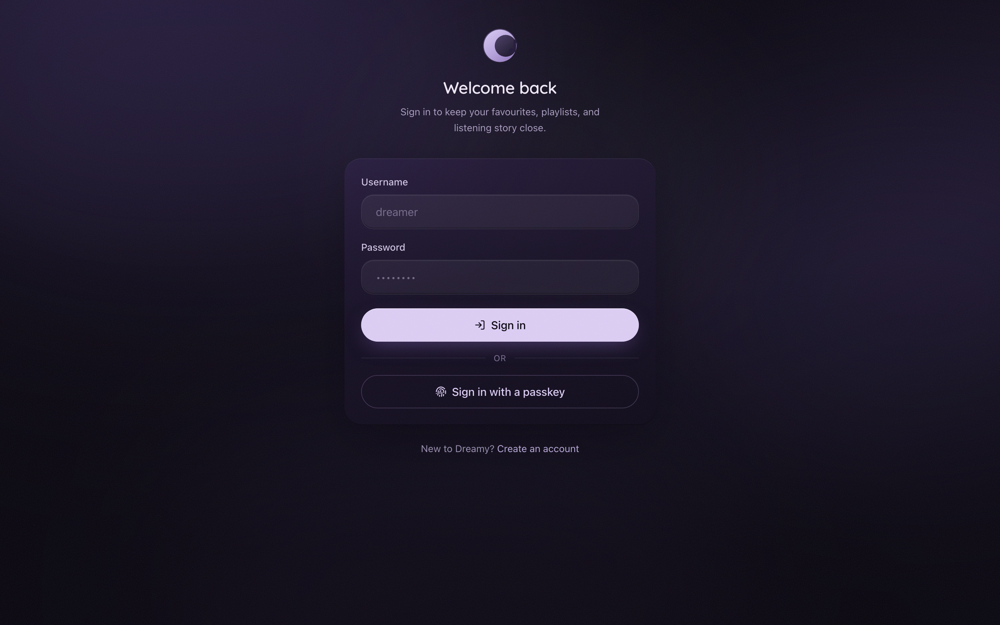 | 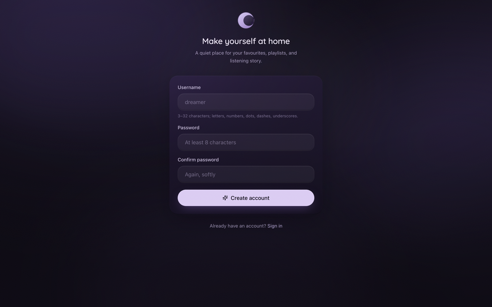 |
| *Sign in — with password or passkey* | *Registration (can be disabled via `ALLOW_SIGNUP`)* |
| 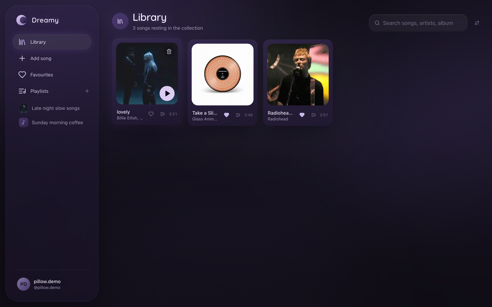 | 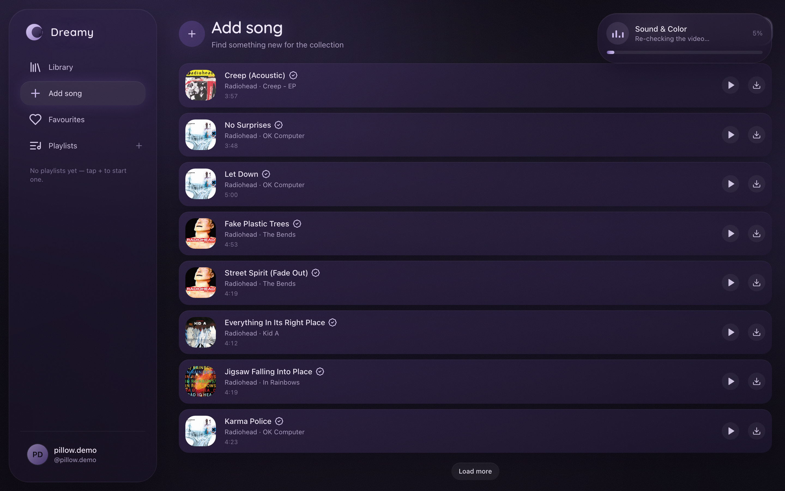 |
| *Library — your whole collection* | *Add song — search, preview, and add in one tap* |
| 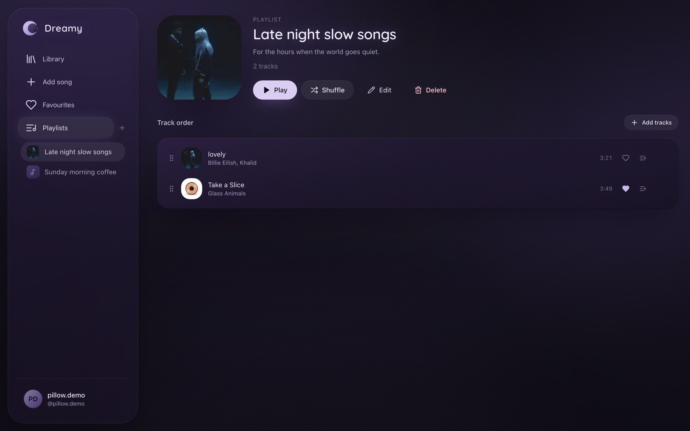 | 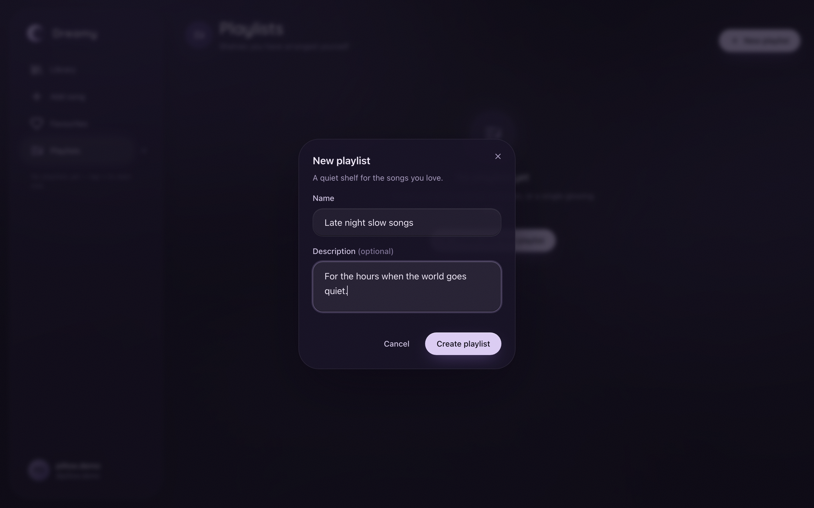 |
| *Playlist detail with drag-to-reorder* | *New playlist* |
| 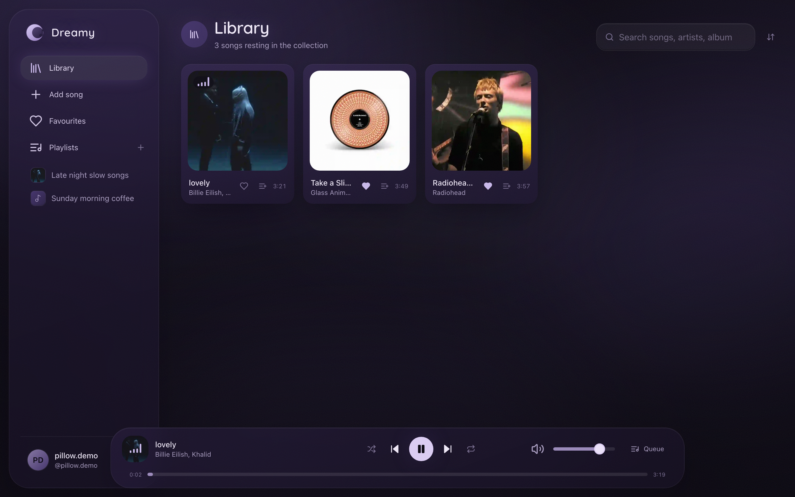 | 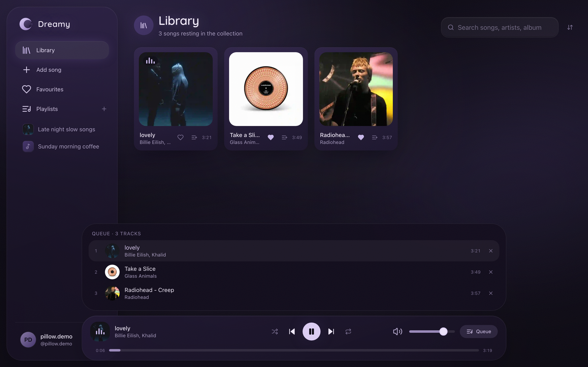 |
| *The bottom player bar* | *Queue panel* |
| 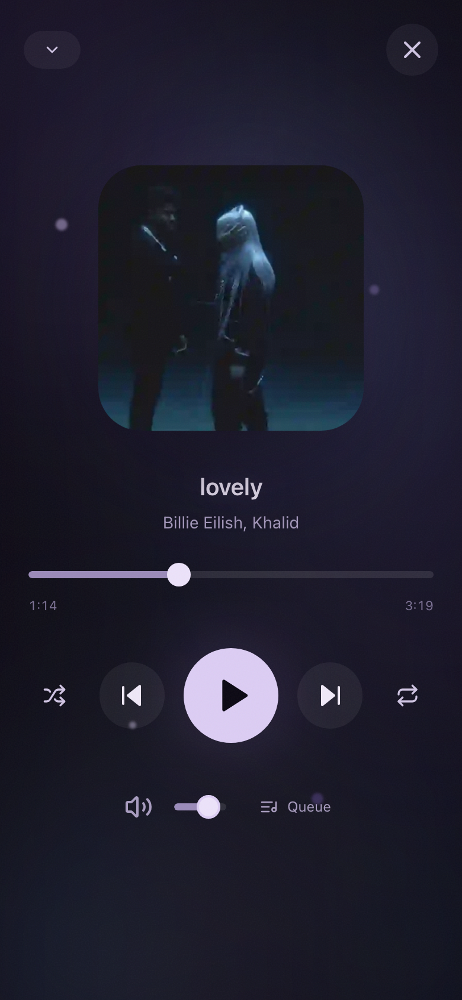 | 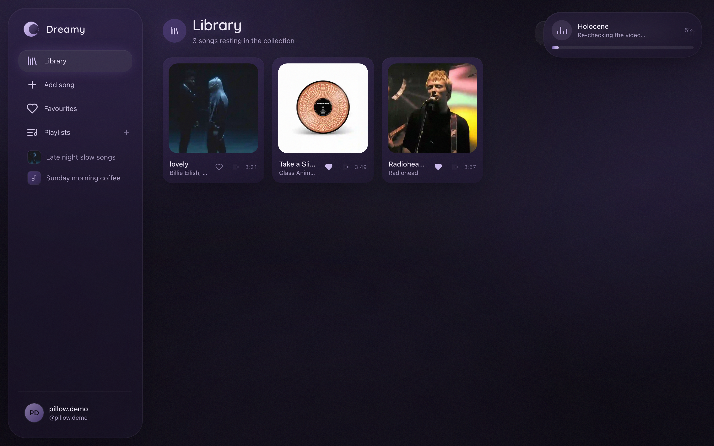 |
| *Expanded player with ambient bloom* | *Live download progress, from anywhere in the app* |
| 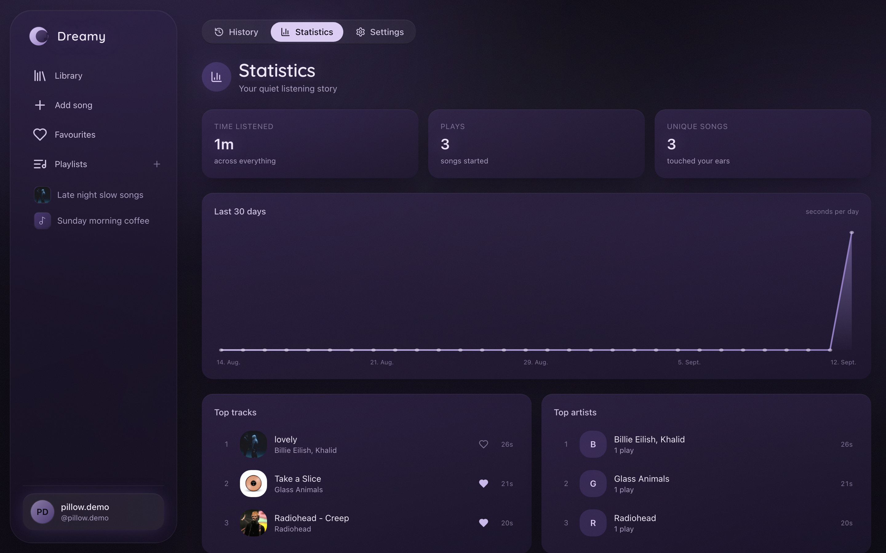 | 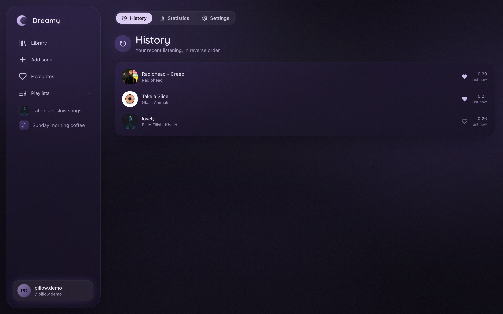 |
| *Statistics — your listening story* | *History* |
| 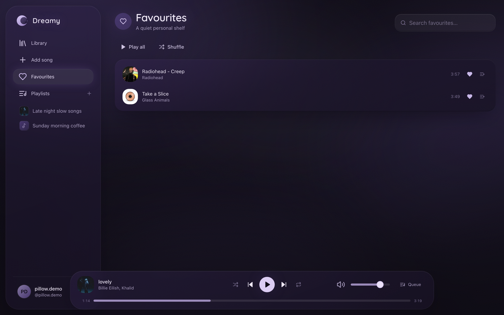 | 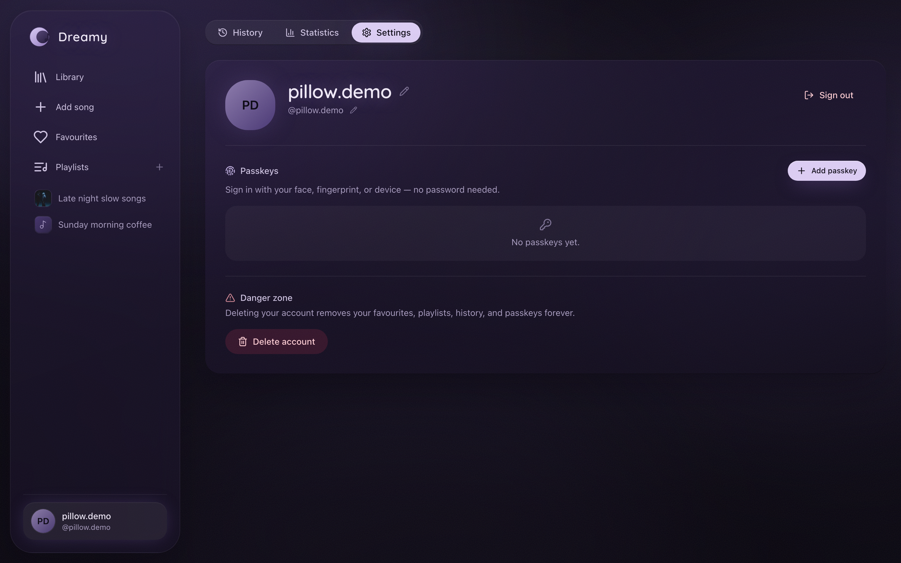 |
| *Favourites* | *Profile — passkeys, display name, avatar* |

More views live in [`screenshots/`](screenshots/) — including the empty states
(`03-library-empty`, `11-playlist-empty`), the search-in-progress animation
(`05-add-searching`), the mobile layout (`19-mobile-library`), and the auth
pages.

---

## 🏗 Architecture

Four cooperating services:

```
┌──────────────┐   HTTP    ┌────────────────────┐
 │   Browser    │◀─────────▶│   Nuxt 3 (Nitro)   │  SSR app + REST API
└──────────────┘           │  :3000             │
                           └─────┬────────┬─────┘
                    SQL/Drizzle  │        │  S3 API
                     ┌───────────────┐  ┌─▼───────┐
                     │  PostgreSQL   │  │  MinIO  │  audio / artwork / avatars
                     │  :5432        │  │  :9000  │
                     └───────────────┘  └─────────┘
                           ▲                ▲
             internal      │                │  upload
             job callbacks │      ┌─────────┴─────────┐
                           └──────│  download worker  │  yt-dlp + FFmpeg
                  (Bearer secret) │  :8787 (Express)  │
                                  └───────────────────┘
```

### 1. The Nuxt app (`app/` + `server/`)

Nuxt 3 with server-side rendering, Vue 3 `<script setup>`, Pinia stores, and
Tailwind CSS. The Nitro server exposes a REST API under `/api/*` — auth,
tracks, playlists, favourites, history, player state, profile, and download
jobs — all session-guarded.

**Frontend highlights**

- `app/stores/player.ts` — the heart of playback: an `HTMLAudioElement`
  lifecycle, OS Media Session mirroring, listening-history accounting, queue
  math (shuffle/reorder/repeat), and cross-reload persistence (localStorage for
  instant restore, then the server as source of truth).
- `app/stores/library.ts`, `downloads.ts`, `auth.ts` — the rest of the state,
  all small and focused.
- Search-as-you-type with sensible debounces, optimistic UI everywhere
  (two-tap delete protection, instant favourite hearts), toasts for feedback.
- Keyboard-first: `/` focuses search, Space toggles playback, arrows seek,
  `M` mutes — and none of these fire while you're typing in a field.

**Server highlights**

- `server/utils/auth.ts` — session cookies are `token.signature` pairs: the
  token is random 256-bit, stored server-side only as a SHA-256 hash, and
  HMAC-signed so a tampered or stale cookie is rejected before touching the
  database.
- `server/api/media.get.ts` — streams audio and images out of MinIO with full
  HTTP Range support (seeking!), long-lived cache headers, and a strict key
  allow-list.
- `server/db/schema/` — Drizzle ORM schema: users, profiles, sessions,
  passkeys, tracks, per-user libraries (`userTracks`), favourites, playlists,
  playlist tracks with position, play history, player state, and download jobs.
- `server/api/internal/jobs/*` — the only endpoints the worker may call,
  authenticated by a shared bearer secret, reporting progress and completion.

### 2. The download worker (`download-service/`)

A standalone Express service (deployed as its own container) that does the
heavy lifting so the web app never blocks:

1. **Re-validate** the video metadata itself (never trusting the browser) and
   enforce the ten-minute rule.
2. **Download** the best audio stream via `yt-dlp`, with real byte-level
   progress reported back to the UI, and multiple player-client fallbacks (a
   client that serves a muted stream fails conversion and the next one is
   tried).
3. **Convert** with FFmpeg: MP3 with loudness normalization
   (`loudnorm`), silence trimming, and ID3 tags from the enriched metadata —
   title, artist, album, cover.
4. **Upload** audio and artwork (square-cropped WebP) to MinIO in parallel
   with the download.
5. **Report completion** — the Nuxt server re-validates everything before
   creating the catalog row.

Search is served by the same worker: YouTube metadata-only search, then
"enrichment" — a small pipeline that normalizes messy titles, deduplicates
uploads, fetches artwork, and attaches previews. It's heavily cached (by URL,
by song, and by title), rate-limit aware (a token bucket for iTunes, a strict
budget for MusicBrainz), and aborts early when the client disconnects.

### 3. PostgreSQL

All application state: users, tracks, playlists, favourites, play history, and
download jobs. Migrations live in `server/db/migrations/` and are applied
automatically at container start (`npm run db:migrate`).

### 4. MinIO (or any S3-compatible store)

Three buckets: `audio`, `artwork`, `avatars`. The app never exposes the store
directly — media flows through the authenticated `/api/media` endpoint.

---

## 🚀 Quick start

### The easy way (Docker)

```bash
git clone <your-fork>
cd dreamy
cp .env.example .env       # then edit SESSION_SECRET, MINIO keys, etc.
scripts/dev.sh up          # builds, starts, and prints status
```

Open **http://localhost:3000**, create an account, add your first song.

What's running:

| Service | Port | What it is |
|---|---|---|
| `nuxt` | `3000` | The web app and API |
| `postgres` | `5432` | Database |
| `minio` | `9000` / `9001` | Object store / web console (`minioadmin` / `minioadmin` by default) |
| `download-worker` | `8787` | yt-dlp + FFmpeg worker |

Handy commands:

```bash
scripts/dev.sh ps        # status
scripts/dev.sh logs      # follow all logs
scripts/dev.sh logs nuxt # just the web app
scripts/dev.sh down      # stop (data volumes survive)
```

The scripts enable the optional Cloudflare Tunnel service automatically when
`TUNNEL_TOKEN` is set in `.env` — see the comments in `.env.example`.

### Manual development (without Docker for the app itself)

You'll still want Postgres and MinIO running somewhere (the compose file's
`postgres` and `minio` services are perfect for that):

```bash
docker compose up -d postgres minio download-worker
npm install
npm run db:migrate
npm run dev
```

### Production

```bash
nano .env                # real secrets this time
./scripts/deploy.sh      # builds the runner image, migrates, starts, tails logs
```

`scripts/deploy.sh` uses `docker-compose.prod.yml`, which swaps the dev
`nuxt` service onto a minimal production image (built `.output`, migrations,
`node .output/server/index.mjs`) — everything else (Postgres, MinIO, worker,
tunnel) is inherited unchanged. Day-2 workflows: `deploy.sh up|ps|logs|down`,
and `PRODUCTION.md` has the full runbook.

---

## ⚙️ Configuration

Everything is configured via environment variables (see `.env.example` for the
full annotated list). The essentials:

| Variable | What it does |
|---|---|
| `DATABASE_URL` | Postgres connection string (or compose builds it from `POSTGRES_*`) |
| `MINIO_*` | Endpoint, port, TLS, credentials, region, and bucket names |
| `SESSION_SECRET` | HMAC key for session cookies — **set a long random value in production** |
| `SESSION_TTL_DAYS` | Session lifetime (default 30) |
| `ALLOW_SIGNUP` | Set `false` to close registration (existing accounts keep working) |
| `DOWNLOAD_SERVICE_URL` / `DOWNLOAD_SERVICE_SECRET` | Where and how the app talks to the worker |
| `WEBAUTHN_RP_ID` / `WEBAUTHN_ORIGIN` | Optional passkey pinning; derived from the request host when empty |
| `TUNNEL_TOKEN` | Optional Cloudflare Tunnel token for exposing the app |

---

## 🗂 Project layout

```
app/                 Nuxt frontend (pages, components, stores, composables)
  pages/             Library, Add song, Favourites, Playlists, Profile, auth
  components/        Player, dialogs, cards, nav — pillow-styled UI kit
  stores/            Pinia stores: player, library, downloads, auth
  composables/       useToast, usePasskeys, useUsernameCheck, useTrackPreview…
server/              Nitro backend
  api/               REST endpoints (auth, tracks, playlists, downloads, …)
  db/                Drizzle schema + migrations
  utils/             env, auth, password hashing, storage helpers
  storage/           MinIO client
download-service/    Standalone worker (Express + yt-dlp + FFmpeg)
  src/yt.ts          YouTube search/metadata/download (multi-client fallback)
  src/enrich.ts      Title normalization, iTunes/MusicBrainz matching, dedupe
  src/ffmpeg.ts      MP3 conversion, loudness normalization, artwork
scripts/             dev.sh, deploy.sh, migrate.mjs
screenshots/         The images you see above
```

---

## 🔐 Security notes

- Passwords are bcrypt-hashed with a per-user salt; usernames have a
  normalized format validated identically on client and server.
- Sessions are opaque random tokens: hashed at rest, HMAC-signed in the
  cookie, `httpOnly`, `SameSite=Lax`, `Secure` in production, with server-side
  expiry.
- The worker's API only accepts requests bearing the shared
  `DOWNLOAD_SERVICE_SECRET`; the browser never talks to it.
- Media keys are validated against a strict pattern before any object-store
  call; the store itself is never exposed.
- Account deletion is a real, typed-confirmation action that removes all user
  data (and garbage-collects orphaned catalog files).

Known trade-offs (also noted in `FUTURE.md`): there are no automated tests
yet, and development-mode secrets have insecure defaults. Neither should ship
to production as-is.

---

## 🛣 Roadmap ideas

- Gapless playback and crossfade between tracks
- Collaborative playlists
- An SSDP/mDNS "home speaker" mode for whole-house audio
- Podcast support (lifting the ten-minute rule per-feed)
- A small test suite for the pure logic (title parsing, range handling, queue
  math) — the codebase is structured for it

---

## 📄 License

Private project — all rights reserved unless a license is added.

*Made with Vue, Tailwind, drizzle-orm, yt-dlp, FFmpeg, and a lot of quiet
evenings.*
